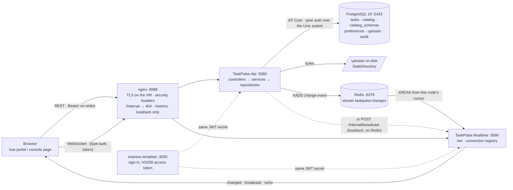

# C# on Linux — REST API + WebSocket server

Two small ASP.NET Core (.NET 10 LTS) services, built and deployed on Ubuntu (WSL 2), with the
production plumbing around them: systemd units with hardening, nginx reverse proxy with WebSocket
upgrade, Docker images, integration tests, and a smoke test.

| Service | What it does | Port |
|---|---|---|
| `TaskPulse.Api` | CRUD for *tasks* (+ stats, search), a *catalog* of reference data (paged, optional JSON Schema per kind), per-user *preferences* and file *uploads* on **PostgreSQL via EF Core** (migrations, optimistic concurrency, data survives restarts); JWT bearer on writes, audit trail, soft delete, ETag/`If-Match`, rate limit, change events to the socket server, `/metrics`, OpenAPI, health checks | 5080 |
| `TaskPulse.Realtime` | WebSocket echo / broadcast / ping with a connection registry, `changed` fan-out from the API (`/internal/broadcast`), graceful shutdown, browser test client | 5090 |
| nginx | Single public entry point in front of both, handles the WebSocket `Upgrade` | 8088 |
| PostgreSQL 18 | The store. Service connects over the Unix socket with peer auth — no password anywhere | 5433 |
| Redis 7 | Change-event stream between the two services (optional: without it the loopback HTTP hop is used) | 6379 |

```
taskpulse/
├── src/
│   ├── TaskPulse.Api/          Program.cs, Controllers/ → Services/ → Repositories/ → Data/ (EF Core), Models/ (DTOs), Infrastructure/
│   └── TaskPulse.Realtime/         Program.cs, Controllers/ (/ws, /stats), Services/ (session, connection manager, router), Models/, wwwroot/
├── tests/
│   ├── TaskPulse.Api.Tests/    36 integration tests through TestServer, each class on its own throw-away PostgreSQL database
│   └── TaskPulse.Realtime.Tests/   8 integration tests through TestServer's WebSocket client
├── deploy/
│   ├── systemd/                     taskpulse-api.service, taskpulse-realtime.service, taskpulse-backup.service + .timer (02:30 nightly)
│   ├── nginx/                       taskpulse.conf (host), taskpulse.compose.conf (docker)
│   └── docker/                      multi-stage Dockerfiles
├── scripts/
│   ├── install.sh                   provision PostgreSQL roles/DBs, publish → /opt/taskpulse, units, nginx  (sudo)
│   ├── test.sh                      dotnet test against the local cluster (detects its port)
│   ├── smoke-test.sh                end-to-end check of a running deployment
│   ├── seed.sh                      40 sample tasks + the catalog kinds, written through the API (idempotent; --force to add again)
│   ├── backup.sh                    pg_dump + uploads tarball, keeps 7; --restore <archive>
│   ├── restore-drill.sh             backup → purge → restore → verify against the compose stack (CI runs it)
│   ├── load/run.sh                  k6 load profile (readers + writers) with thresholds; last-run.json keeps the figures
│   └── run-dev.sh                   both services from source with hot reload
├── docker-compose.yml
├── Directory.Build.props            net10.0, nullable, warnings-as-errors, invariant globalization
└── global.json                      SDK 10.0.1xx
```

## Architecture



Every write goes browser → nginx → API → PostgreSQL, and the API tells Realtime, which fans a `changed` event out to
every socket — that is how a second tab refreshes without polling. The API and Realtime never share memory: the hop
is a Redis stream (durable, multi-node) or, without Redis, a loopback HTTP post that nginx never exposes.

## Quick start

Prerequisites: Ubuntu 24.04+/WSL 2, `sudo apt install dotnet-sdk-10.0 postgresql nginx`.

### 1. Build and test

```bash
dotnet build TaskPulse.sln -c Release     # 0 warnings — warnings are errors
sudo scripts/install.sh                    # once: creates the taskpulse_dev role the tests use (and deploys)
scripts/test.sh                            # 44 tests on the real PostgreSQL cluster (+ Redis for the stream tests); --coverage for line rates
```

### 2. Run — pick one

**From source (development)**

```bash
scripts/run-dev.sh                          # hot reload; REST on :5080, WebSocket on :5090
```

**As systemd services behind nginx (what the demo uses)**

```bash
sudo scripts/install.sh                     # idempotent; re-run to redeploy
scripts/smoke-test.sh                       # exercises everything through nginx on :8088
sudo scripts/install.sh --uninstall         # clean removal
```

**Docker**

```bash
docker compose up --build                   # REST :5080, WS :5090, nginx :8088
```

### 3. Try it

```bash
# REST
curl -s http://127.0.0.1:8088/api/tasks | jq
# writes need a bearer token: the access token part A hands out at sign-in, or one signed with the same secret
# (scripts/smoke-test.sh mints one from /etc/taskpulse/api.env — see mint_token there)
curl -s -X POST http://127.0.0.1:8088/api/tasks -H "Authorization: Bearer $TOKEN" -H 'Content-Type: application/json' \
     -d '{"title":"Review the C# assignment","description":"Sat 19 Sep"}' | jq
curl -s http://127.0.0.1:8088/openapi/v1.json | jq '.paths | keys'

# WebSocket — open http://127.0.0.1:8088/ in two browser tabs and press "broadcast",
# or from a terminal with node ≥ 22:
node -e 'const ws=new WebSocket("ws://127.0.0.1:8088/ws");ws.onmessage=e=>console.log(e.data);ws.onopen=()=>ws.send(JSON.stringify({type:"echo",data:"hi"}))'
```

## REST API

Base path `/api/tasks`. JSON in and out; enums as strings; errors as RFC 9457 `application/problem+json`.

| Method | Path | Success | Errors |
|---|---|---|---|
| `GET` | `/api/tasks?status=Todo&q=postgres&priority=High&assignee=me&label=docs&due=overdue&page=1&pageSize=20` | 200 `{items, page, pageSize, total}` — open tasks with a due date first | 400 (`q` > 100 chars) |
| `GET` | `/api/tasks/stats?days=14` | 200 `{total, byStatus, completionRate, createdToday, doneThisWeek, donePreviousWeek, oldestOpen, recentlyUpdated[], daily[]}` | 400 (`days` ∉ 1–90) |
| `GET` | `/api/tasks/{id}?includeDeleted=` | 200 + `ETag: W/"<version>"` | 404 |
| `POST` 🔒 | `/api/tasks` `{title, description?, priority?, dueAt?, assigneeId?, assigneeName?, labels?}` | 201 + `Location` | 400 validation, 401 |
| `PUT` 🔒 | `/api/tasks/{id}` `{title, description?, status, priority?, dueAt?, assigneeId?, assigneeName?, labels?}` (+ `If-Match`) — a **replacement**, send the whole task | 200 + `ETag` | 400, 401, 404, **412** stale `If-Match` |
| `DELETE` 🔒 | `/api/tasks/{id}` · `?permanent=true` (Admin) | 204 — soft delete, restorable · purge | 401, 403, 404 |
| `POST` 🔒 | `/api/tasks/{id}/restore` | 200 | 401, 404 |
| `GET` 🔒 | `/api/audit?resource=task&limit=20` | 200 `[{at, actor, action, resource, kind, targetId, summary}]`; `resource=auth` / `account` (sign-in events from part A) for Admins only | 400, 401, 403 |
| `POST` | `/api/audit` `{actor, action, resource, targetId, summary}` + `X-Internal-Token` | 202 — events reported by part A (`Api:AuditIngestToken`) | 400, 403 |
| `GET` | `/api/tasks/export.csv?…same filters…` | 200 `text/csv` (id, title, description, status, priority, dueAt, assigneeId, assigneeName, labels, createdAt, updatedAt) | — |
| `POST` 🔒 | `/api/tasks/import` (body `text/csv` or multipart `file`) | 200 `{created, updated, skipped:[{row, error}]}` — `title` required, an existing `id` is updated, labels `a\|b`, ≤ 2000 rows; bad rows are reported, the rest go through | 400, 401 |
| `GET` | `/api/catalog/{kind}/export.csv` · `POST` 🔒 `/api/catalog/{kind}/import` | same shape for a kind (code, label, parents `a\|b`, attributes JSON, sort); an existing `code` is updated | 400, 401 |
| `GET/POST` 🔒 Admin | `/api/webhooks` `{url, secret (16–200), resources?: ["task","catalog","upload","preferences"], description?}` · `GET/PUT/DELETE …/{id}` · `GET …/{id}/deliveries` | 201 the hook (never the secret); `PUT` changes url / secret / resources / active; the newest 50 deliveries `{at, event, attempts, status, error, delivered}` | 400 (plain `http` only on loopback), 401, 403, 404 |
| `GET` | `/health` · `/health/ready` | 200 `Healthy` | 503 |
| `GET` | `/metrics` | Prometheus text (loopback only through nginx) | — |
| `GET` | `/openapi/v1.json` | OpenAPI 3 document (bearer scheme declared) | — |

`status` ∈ `Todo | InProgress | Done`, `priority` ∈ `Low | Normal | High` (default Normal). `dueAt` is any instant;
`due` filters `overdue | today | week | none`. `assigneeId` is a user id from part A's `/api/users` (`assignee=me` is
the caller's own); `assigneeName` is stored with it so lists need no join. `labels`: up to 10, ≤ 32 chars each,
lower-cased and de-duplicated on write (`label=` filters on one). `q` is a **full-text search** over title and description: PostgreSQL `tsvector` (English stemming, so
*upgrading* finds *upgrade*) with every term as a prefix (so *postg* still finds *PostgreSQL*), results ranked by
relevance; operator characters typed by a user are just words, never tsquery syntax. `pageSize` is clamped to `Api:MaxPageSize` (100 by default). `/api/tasks/stats` answers
with three grouped queries (by status, created per day, done per day) plus `overdue` and `dueThisWeek` counts — no
row is loaded — so a dashboard costs one request however many tasks exist.

### Authentication, audit, concurrency, limits

🔒 **Every write needs a bearer token** — the access token that part A (express-template) issues at sign-in. TaskPulse
validates it with the same HS256 secret (`Api:JwtSecret`, written by `install.sh` from `TASKPULSE_JWT_SECRET`; the kit's
bootstrap replaces the template's 9-character default with 48 random characters first). Reads stay open so the public
dashboards and the console work without a session. The token's `sub`, `roles` and `user_meta.email` become the
**actor**: `createdBy`/`updatedBy` on tasks and catalog items, `ownerId` on uploads (only the owner or an `Admin` may
delete), and preferences can only be written for your own `user-<sub>` key. 401/403 are problem+json like every other error.

**Audit trail** — every create / update / move / delete / restore / purge writes a row (`who, what, which, when, summary`)
and `GET /api/audit` lists them newest first. A failure to write the audit row never fails the request (it is logged).

**Soft delete** — `DELETE` stamps `deletedAt`; deleted tasks leave every list and the stats, `?includeDeleted=true` shows
them, `POST …/restore` brings one back, and `?permanent=true` (Admin role) purges the row.

**Lost-update protection** — single GETs answer with a weak `ETag` built from PostgreSQL's `xmin`; send it back in
`If-Match` on `PUT` and a stale value is refused with **412** instead of overwriting someone else's change (`xmin` also
guards the database itself). Without `If-Match` the last write wins, as before.

**Rate limit** — writes are limited per client address (`Api:WritesPerMinute`, default 120/min, fixed window); the 121st
answers **429** problem+json with `Retry-After`. Reads are not limited.

**Change events** — after every write the API emits `{type:"changed", resource, action, id, kind, actor}` and
Realtime fans it out to every socket, so every open page refreshes without polling. Fire-and-forget through a bounded
channel: a write never waits for the socket server. Two transports, chosen by configuration:
- **Redis stream** (`Api:RedisUrl` / `WebSocket:RedisUrl`, what `install.sh` configures when a local Redis answers and
  what compose uses): `XADD taskpulse:changes` (capped at ~10 000 entries) plus a `PUBLISH` nudge; Realtime follows the
  stream and keeps its cursor in Redis per node, so an event written **while Realtime is restarting is delivered when it
  is back**, and any number of Realtime nodes can follow the same stream.
- **Loopback HTTP** (`Api:RealtimeInternalUrl`, the fallback without Redis): `POST /internal/broadcast`, loopback-only;
  nginx returns 404 for `/internal/`; a shared `X-Internal-Token` covers a split host without Redis.

**Outgoing webhooks** — an Admin registers URLs (`POST /api/webhooks`) and every change event is POSTed to each active
hook that wants that resource: JSON `{event:"task.create", at, resource, action, id, kind, actor}` with
`X-TaskPulse-Event` and `X-TaskPulse-Signature: sha256=<HMAC-SHA256 of the body with the hook's secret>`, so a receiver
can verify the sender without a shared session. Three attempts (1 s, 4 s apart, 5 s timeout each), every hook in
parallel, and each outcome is logged (`…/deliveries`, newest 50 kept); a hook that fails 20 deliveries in a row is
switched off so a dead endpoint stops costing retries. The same bounded channel as the socket fan-out: a write never
waits for a webhook, and a hook deleted while its retries were running is simply skipped.

**Metrics** — `/metrics` (prometheus-net: request counts, durations, in-flight) for scraping from the box.

### Catalog — reference data with CRUD (`/api/catalog`)

Every list the portal (part A) used to hard-code — regions, countries, states, places on the map,
links, form options, tags — is a *kind* here. An item has a `code` unique within its kind, a `label`, optional
`parents` (codes of another kind, for cascades), free-form `attributes` (a JSON object, ≤ 4 KB, e.g.
`{"lat": -6.2, "lng": 106.8}`) and a `sort` order.

| Method | Path | Success | Errors |
|---|---|---|---|
| `GET` | `/api/catalog` | 200 `[{kind, count}]` | — |
| `GET` | `/api/catalog/{kind}?parent=asia&q=rus&page=1&pageSize=100` | 200 `[items]` (by `sort` then `label`) + `X-Total-Count`, `X-Page`, `X-Page-Size` | 400 bad paging |
| `GET` | `/api/catalog/{kind}/{code}` | 200 + `ETag` | 404 |
| `POST` 🔒 | `/api/catalog/{kind}` `{code?, label, parents?, attributes?, sort?}` | 201 + `Location`; `code` derived from `label` when omitted | 400 validation / schema, 401, 409 duplicate code |
| `PUT` 🔒 | `/api/catalog/{kind}/{code}` `{label, parents?, attributes?, sort?}` (+ `If-Match`) | 200 + `ETag` | 400, 401, 404, 412 |
| `DELETE` 🔒 | `/api/catalog/{kind}/{code}` | 204 — the code is also removed from every item's `parents` | 401, 404 |
| `GET` | `/api/catalog/{kind}/_schema` | 200 the JSON Schema for this kind's `attributes` | 404 none set |
| `PUT` 🔒 Admin | `/api/catalog/{kind}/_schema` `{schema}` | 200 | 400 invalid schema **or existing items violate it** (listed), 401, 403 |
| `DELETE` 🔒 Admin | `/api/catalog/{kind}/_schema` | 204 | 401, 403, 404 |

`kind` and `code` match `^[a-z0-9][a-z0-9-]{0,63}$` (anything else is a 404 from routing). One table, a unique
index on `(kind, code)` and a GIN index on `parents` — a dedicated entity per list would have been nine copies of
the same controller. `scripts/seed.sh` seeds the kinds the portal needs and skips a kind that already has items.

`attributes` stays free-form by default; an Admin can pin a **JSON Schema** per kind (`_schema`, JsonSchema.Net,
≤ 16 KB) and from then on every create/update is validated against it (400 with the schema errors). A schema that the
existing items already violate is refused, so a kind never ends up half-conforming. Lists are paged the same way tasks
are (`page`, `pageSize` ≤ `Api:MaxPageSize`) and carry the total in headers so the cascade dropdowns can stay one call.

### Preferences (`/api/preferences/{userId}`)

`GET` always 200 — the defaults with `saved: false` until the user has saved once, `PUT {theme: light|dark|system, nickname?}` (upsert, 200), `DELETE` (204). The portal keys
this by the user id in its JWT (`user-<sub>`), so theme and nickname survive a reload and a different browser. Writes
🔒 need a token and answer 403 unless the key is the caller's own (or the caller is `Admin`).

### Uploads (`/api/uploads`)

| Method | Path | Success | Errors |
|---|---|---|---|
| `POST` 🔒 | `multipart/form-data`: `files[]`, `source?` (tag), `note?` | 201 `[items]` (with `ownerId`) | 400 no file, 401, 413 > `Api:MaxUploadBytes` (2 MB), 415 type not png/jpeg/webp/pdf/txt **or bytes that do not match the declared type** |
| `GET` | `/api/uploads?source=signpad` | 200 newest first (≤ 100) | — |
| `GET` | `/api/uploads/{id}` · `/api/uploads/{id}/content` | 200 metadata · the bytes with the original content type, range requests supported | 404 |
| `DELETE` 🔒 | `/api/uploads/{id}` | 204 (row and file) | 401, 403 not the owner (Admin may), 404 |

Bytes live under `Api:UploadDirectory` — `/var/lib/taskpulse/uploads` via systemd `StateDirectory=` (the only path
the hardened unit can write), a named volume in compose — and only the metadata is in PostgreSQL. Files are stored
under their id, never under the client-supplied name.

**Browsers on another origin:** CORS is off unless `Api:AllowedOrigins` lists the origin
(`Api__AllowedOrigins__0=https://portal.example`; `install.sh` writes it from `TASKPULSE_ALLOWED_ORIGINS="origin ..."`).
Allowed origins get `GET POST PUT DELETE`, the `Content-Type`, `Authorization` and `If-Match` request headers and the
`Location`, `ETag`, `X-Total-Count`, `X-Page`, `X-Page-Size` response headers — nothing else, and never `*`. The Vue + Express portal (part A) uses this to show a live task board driven by this API and the
WebSocket server.

**Storage:** PostgreSQL 18 through EF Core (Npgsql). Schema managed by migrations (applied at startup),
`xmin` as an optimistic-concurrency token, `timestamptz` columns, indexes on `status` and `created_at`.
The connection string is the only environment-specific piece — `ConnectionStrings:Tasks`:

| Where | Connection | Auth |
|---|---|---|
| systemd service | `Host=/var/run/postgresql;Port=5433;Database=taskpulse;Username=taskpulse` from `/etc/taskpulse/api.env` (root:root 0600) | **peer** — the OS user *is* the credential, no password exists |
| `dotnet run` / tests | `localhost`, role `taskpulse_dev` (throwaway password, `CREATEDB`) | password, local only |
| Docker compose | `Host=postgres`, `POSTGRES_PASSWORD` from the environment | password, injected |

Nothing is seeded by the database layer: `scripts/seed.sh` writes 40 sample tasks (16 Done, 12 InProgress, 12 Todo) **through the API** (it skips
itself when the table already has rows; `--force` adds the set again), and the VM bootstrap runs it once.
Every response carries `X-Correlation-Id` — send your own to trace a request through the logs.

## WebSocket server

Endpoint `ws://host/ws`. Text frames, JSON both ways.

Client → server: `{"type":"echo"|"broadcast"|"ping","data":"..."}` and `{"type":"auth","token":"<access token>"}` —
anything that is not a JSON object is treated as `echo` so raw tools (`websocat`, `wscat`) work too.

Server → client:

| `type` | When | Payload |
|---|---|---|
| `welcome` | on connect | `connectionId`, `connections` |
| `echo` | reply to `echo` | `from`, `data` |
| `authed` | reply to a valid `auth` | `connectionId`, `user` (email from the token) |
| `broadcast` | fan-out to **every** connection | `from`, `actor` (who said it), `data` |
| `pong` | reply to `ping` | `from` |
| `system` | someone joined / left | `event`, `connectionId`, `connections` |
| `changed` | after every API write (see change events above) | `resource`, `action`, `id`, `kind`, `actor` |
| `error` | bad JSON / unknown type / binary frame / not signed in / rate limited | `error` |

**Who may talk:** anyone may connect and listen (echo, ping, change events). `broadcast` — a message to every open
tab — needs the connection to have sent `auth` with the access token from the Vue + Express sign-in first, validated
with the same HS256 secret the API uses (`WebSocket:JwtSecret`, written by `install.sh` to `/etc/taskpulse/realtime.env`);
the broadcast then carries the sender's email as `actor`. Without it an anonymous socket could spam every user.
The portal's socket bus sends `auth` right after each handshake (and again after a token refresh).

**Limits, per connection:** `WebSocket:MessagesPerMinute` (120) — past it every message is answered with an `error`,
past twice it the server closes with **1008**; `WebSocket:BroadcastsPerMinute` (30); 64 KiB per message (close code
1009 beyond that); 30 s server-side keep-alive pings.

`GET /stats` lists live connections (with `user` once authenticated). `GET /health` for probes. `GET /` is a
dependency-free console page (its script and stylesheet are separate files so the CSP can forbid inline code).

## Load figures

`scripts/load/run.sh` runs a k6 profile (`scripts/load/api.js`): 25 virtual users reading (paged list, stats, one task,
a catalog page, ~4 requests each per second) for 70 s, plus 2 writing (create → update → purge, so the audit row, the
change event and the write limiter are in the numbers). Measured against Kestrel on the dev box (WSL 2, 12 vCPU,
PostgreSQL and Redis on the same machine), 2026-09-20:

```
requests: 5804 in 72s (80.1/s), failed 0.00%
readers  med 1.8 ms  p95 3.7 ms  max 9.7 ms
writers  med 8.1 ms  p95 10.4 ms  max 16.0 ms
```

Thresholds in the script (p95 < 300 ms reads, < 500 ms writes, < 1 % failures) are far above what one box does; they
are there so a regression shows as a failed run, not as a slower number nobody reads. Through nginx a single client
address is capped at 30 requests/s (`limit_req`, 503 beyond), which is why the profile targets the application port —
run it against `:8088` to watch the edge limiter instead.

## Design decisions — the "best practices" and why each one is there

**Application**
- **MVC layering, one direction only**: `Controllers` (HTTP in/out, nothing else) → `Services` (rules:
  normalisation, timestamps, paging clamps, logging) → `Repositories` (EF Core queries) → `Data` (context,
  entity, migrations). `Models` holds the API contract (resource, request DTOs, paged envelope). Each layer
  depends on the one below through an interface, so the service is unit-testable with a fake repository and
  the repository can be swapped without touching a controller.
- **Thin `[ApiController]` controllers with declarative validation**: request DTOs carry DataAnnotations,
  the framework returns RFC 9457 `application/problem+json` before an action runs, and `[ProducesResponseType]`
  makes the OpenAPI document list every status code an action can return. Error keys are camel-cased to
  match the JSON contract (`errors.title`, not `errors.Title`).
- **Repository behind an interface** (`ITaskRepository`) with an **EF Core + PostgreSQL** implementation:
  reads are `AsNoTracking`, paging and filtering are SQL, delete is a single `ExecuteDelete`, updates carry
  an `xmin` concurrency token so two racing writers cannot silently overwrite each other, transient
  faults are retried. The storage entity is separate from the API record so the schema can grow without
  touching the contract.
- **Request DTOs separate from the resource**: clients cannot set `id` or timestamps; nullable fields
  so *validation* decides what "missing" means, not the deserializer.
- **Options pattern with `ValidateOnStart`**: a bad `Api:MaxPageSize` fails the process at boot, not
  on the first request. Overridable via environment (`Api__MaxPageSize=200`) — see the units and compose file.
- **problem+json everywhere**: validation failures, unreadable bodies (a bad enum value, truncated JSON)
  and 404s from `NotFound()` all come back as RFC 9457 problem documents, plus a custom `IExceptionHandler`
  so a body Kestrel itself rejects is a 400 in *every* environment.
- **Structured JSON logging** with a correlation-id scope on every line; journald, Docker, Loki and
  Datadog parse it as-is.
- **Liveness vs readiness** (`/health`, `/health/ready`): readiness opens the database, checks for pending
  migrations (→ *Degraded*) and runs a real query. A k8s / load-balancer distinction that costs nothing to
  get right from the start.
- **Correct WebSocket lifecycle**: one send lock per socket (the API allows only one in-flight send),
  frame reassembly up to a hard cap, server-side keep-alive pings, and a *real* graceful shutdown —
  see "Things learned" below.
- **Warnings are errors, nullable enabled, invariant globalization**: cheap discipline; the invariant
  mode is also what lets the runtime image ship without ICU.

**Deployment**
- **Dedicated system user, loopback-only Kestrel, nginx in front**: the apps never face the network
  directly; TLS, rate limiting and access logs belong in the proxy.
- **No database password anywhere**: the service reaches PostgreSQL over the Unix socket and is
  authenticated by its OS identity (`peer`). The connection string sits in a root-only `EnvironmentFile`,
  outside the unit and outside git. Dev/tests use a separate throwaway role.
- **systemd units with hardening**: `systemd-analyze security` scores both services **1.7 (OK)**
  versus 9+ for an unhardened unit. `ProtectSystem=strict`, empty capability set, syscall filter,
  etc. Deliberately **not** `MemoryDenyWriteExecute` — the .NET JIT needs W+X pages.
- **`install.sh` is idempotent and publishes as the invoking user** so the checkout never ends up
  with root-owned `bin/`/`obj/`.
- **nginx WebSocket config**: `proxy_http_version 1.1` + `Upgrade`/`Connection` headers via a `map`,
  and `proxy_read_timeout` raised from the 60 s default so idle sockets are not killed.
- **Multi-stage Docker images**: SDK never ships; runtime layer runs as the non-root `app` user;
  restore is its own cache layer.
- **Smoke test** that exercises the real deployment path (through nginx), not just the code.

## Tests

```
TaskPulse.Api.Tests   40 passed   tasks: CRUD round-trip (re-read after update), data survives a process restart,
                                       concurrent updates, validation 400, bad enum 400, 404, page-size clamp,
                                       q search + LIKE escaping, stats shape and range check, CORS allow-list,
                                       health, correlation id, OpenAPI
                                     catalog: CRUD with derived code and jsonb attributes, 409 on duplicate,
                                       parent filter / search / ordering, delete cascades out of parents, bad input
                                     preferences: defaults before save, upsert + read back, invalid theme, defaults again after delete
                                     uploads: round trip incl. downloaded bytes, 413 / 415 (signature mismatch) / 400
                                     security + contract: anonymous write 401, expired token 401, wrong role 403 on purge
                                       and schema, preferences for someone else's key 403, audit row names the actor,
                                       soft delete -> includeDeleted -> restore, ETag round trip + stale If-Match 412,
                                       429 with Retry-After past the write limit, catalog paging headers,
                                       schema refused when items violate it then enforced on create
                                     change stream: a write lands in the Redis stream with the actor (needs Redis)
                                     webhooks: non-Admin 403, plain-http URL 400, signed delivery with the actor,
                                       resource filter, 3 attempts on 503 logged + failure count, off = no deliveries
TaskPulse.Realtime.Tests   8 passed   welcome/echo/pong, anonymous broadcast refused → auth (bad / expired / valid
                                       token) → broadcast to two clients with the actor, rate limits (error, then 1008),
                                       raw text + bad JSON, plain GET on /ws is 400, /stats + /health,
                                       /internal/broadcast fans out `changed` (and refuses a forwarded request),
                                       stream entry → `changed` on every socket + cursor persisted (needs Redis)
```

All are integration tests through `WebApplicationFactory<Program>` — real routing, JSON, middleware, the real
Npgsql provider against a **throw-away database created per test class on the real server** (dropped after),
and (for the socket) TestServer's in-memory WebSocket client. No mocks, no in-memory database provider.
In CI these are `postgres` and `redis` service containers (`TASKPULSE_TEST_PG`, `TASKPULSE_TEST_REDIS`); the two
stream tests skip themselves when no Redis is configured.

## Things learned while building this (worth asking me about)

1. **A cancelled `ReceiveAsync` aborts the socket.** My first shutdown implementation cancelled the
   receive loop on `ApplicationStopping`; clients saw close code **1006** (abnormal). The socket
   enters *Aborted* and no close frame can be sent. The fix is to send our close frame with
   `CloseOutputAsync` and keep receiving until the peer's close frame arrives. Verified: clients now
   get **1001 "Server shutting down", wasClean=true** on `systemctl restart`, both direct and via nginx.
2. **`location = /health` is an exact match** in nginx — `/health/ready` fell through to the wrong
   upstream. The smoke test caught it.
3. **`systemctl reload nginx` is graceful**, so a test fired immediately afterwards can still hit the
   old workers. Wait for readiness before asserting.
4. **`ThrowOnBadRequest` differs by environment**: the first cut used minimal APIs, where a malformed body
   is 400 in Production and 500 in Development unless you handle `BadHttpRequestException` yourself. The
   test `Update_with_unknown_status_returns_bad_request` caught it; the handler stayed after the move to MVC.
5. **systemd splits an unquoted `Environment=` on whitespace.** `Environment=ConnectionStrings__Tasks=Data Source=…`
   handed the app the value `Data` and the service crash-looped at `MigrateAsync`. Quote the whole assignment.
   `install.sh` now fails loudly with the journal tail instead of waiting on a crash-looping unit.
6. **Port 5432 was already taken** on the demo box by the Node template's PGlite. Ubuntu's installer put the
   cluster on 5433; everything reads the port from `pg_lsclusters` instead of assuming 5432, and the Unix
   socket path includes it (`.s.PGSQL.5433`).
7. **PostgreSQL stores microseconds; .NET ticks are 100 ns.** The `POST` response and the row read back
   differed by a few hundred nanoseconds and a round-trip equality test failed. Timestamps are now generated
   at microsecond precision (`Timestamps.UtcNow()`) so what the API returns is exactly what is stored.
8. **`sudo -S` and a heredoc both want stdin.** A provisioning one-liner silently fed SQL to sudo as the
   password. Not in the shipped scripts (they run as root already) — but it cost twenty minutes.

## What I would add for production

- Migrations as a deploy step (`dotnet ef database update` in the pipeline) rather than at startup, once
  there is more than one instance.
- Return 409 with the current representation on a concurrency conflict instead of 404.
- AuthN/Z (JWT bearer on the API, ticket-based auth on the WebSocket handshake).
- OpenTelemetry traces/metrics export (the `TraceId` is already in every log line).
- Rate limiting (`AddRateLimiter`) and request size limits at the proxy.
- `Type=notify` units via `Microsoft.Extensions.Hosting.Systemd` for true readiness signalling.
- A CI pipeline: build → test → `docker build` → `systemd-analyze verify` on the units.
